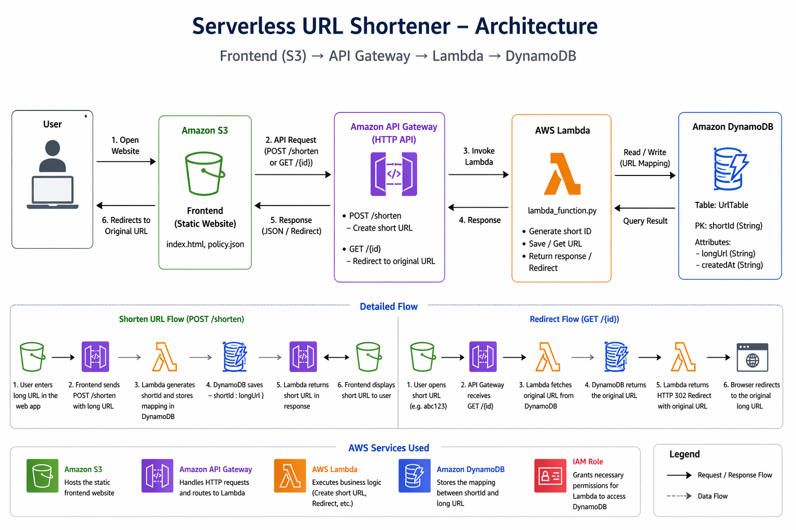

# 🔗 Serverless URL Shortener (AWS)

A fully serverless URL shortener built using AWS services.
Users can enter a long URL and get a shortened link that redirects to the original URL.

---

## 🚀 Architecture



---

## 🧰 Tech Stack

* **Frontend**: HTML, CSS, JavaScript (hosted on S3)
* **Backend**: AWS Lambda (Python)
* **API Layer**: Amazon API Gateway (HTTP API)
* **Database**: Amazon DynamoDB
* **Deployment**: AWS CLI

---

## 📸 Features

* Generate short URLs instantly
* Redirect to original URL
* Copy-to-clipboard support
* Fully serverless architecture
* No authentication required (simple MVP)

---

## 🧠 How It Works

1. User enters a long URL in the frontend
2. Frontend sends POST request to API Gateway
3. API Gateway triggers Lambda function
4. Lambda:

   * Generates a random short ID
   * Stores `{ shortId → longUrl }` in DynamoDB
5. When user visits `/shortId`:

   * Lambda fetches original URL
   * Returns HTTP 302 redirect

---

## 📁 Project Structure

```
URL_Shortener_Service/
│
├── Frontend/
│   ├── index.html          # UI for URL shortening
│   └── policy.json         # S3 bucket public access policy
│
├── Backend/
│   ├── lambda_function.py  # AWS Lambda logic (Python)
│   ├── lambda-trust.json   # IAM role trust policy
│   └── function.zip        # Deployment package (generated)
│
├── README.md
```

## ⚙️ Prerequisites

* AWS Account
* AWS CLI installed & configured
* Basic knowledge of AWS services

---

## 🛠️ Deployment Guide (Step-by-Step)

### 1️⃣ Create S3 Bucket (Frontend Hosting)

```bash
aws s3 mb s3://your-bucket-name

aws s3 website s3://your-bucket-name \
--index-document index.html
```

Upload frontend:

```bash
aws s3 cp Frontend/index.html s3://your-bucket-name
```

---

### 2️⃣ Create DynamoDB Table

```bash
aws dynamodb create-table \
--table-name UrlTable \
--attribute-definitions AttributeName=shortId,AttributeType=S \
--key-schema AttributeName=shortId,KeyType=HASH \
--billing-mode PAY_PER_REQUEST
```

---

### 3️⃣ Create Lambda Function

Zip your function:

```bash
zip function.zip lambda_function.py
```

Create IAM role (Lambda execution role):

* Attach:

  * AmazonDynamoDBFullAccess
  * AWSLambdaBasicExecutionRole

Create function:

```bash
aws lambda create-function \
--function-name UrlShortenerFunction \
--runtime python3.12 \
--role YOUR_ROLE_ARN \
--handler lambda_function.lambda_handler \
--zip-file fileb://function.zip
```

---

### 4️⃣ Create API Gateway (HTTP API)

```bash
aws apigatewayv2 create-api \
--name url-shortener-api \
--protocol-type HTTP
```

Create integration:

```bash
aws apigatewayv2 create-integration \
--api-id YOUR_API_ID \
--integration-type AWS_PROXY \
--integration-uri YOUR_LAMBDA_ARN \
--payload-format-version 2.0
```

Create routes:

```bash
POST /shorten
GET /{id}
```

Create stage:

```bash
aws apigatewayv2 create-stage \
--api-id YOUR_API_ID \
--stage-name prod \
--auto-deploy
```

---

### 5️⃣ Enable Lambda Permission

```bash
aws lambda add-permission \
--function-name UrlShortenerFunction \
--statement-id apigateway-access \
--action lambda:InvokeFunction \
--principal apigateway.amazonaws.com \
--source-arn "arn:aws:execute-api:REGION:ACCOUNT_ID:API_ID/*/*"
```

---

### 6️⃣ Enable CORS

```bash
aws apigatewayv2 update-api \
--api-id YOUR_API_ID \
--cors-configuration 'AllowOrigins=["*"],AllowMethods=["GET","POST","OPTIONS"],AllowHeaders=["*"]'
```

---

### 7️⃣ Connect Frontend to API

Update `index.html`:

```js
const AWS_API_ENDPOINT = "https://YOUR_API_ID.execute-api.REGION.amazonaws.com/prod/shorten";
```

Upload again:

```bash
aws s3 cp Frontend/index.html s3://your-bucket-name
```

---

## 🧪 Testing

### Create short URL:

```bash
curl -X POST "https://API_ID.execute-api.REGION.amazonaws.com/prod/shorten" \
-H "Content-Type: application/json" \
-d '{"url":"https://google.com"}'
```

### Access short URL:

```
https://API_ID.execute-api.REGION.amazonaws.com/prod/{shortId}
```

---

## 🔐 Security Notes

* Do NOT commit AWS credentials
* Use IAM roles with least privilege
* Use GitHub Secrets for CI/CD

---

## 📌 Future Improvements

* Custom short URLs
* Click analytics
* Expiration links
* User authentication
* Custom domain (Route 53 + CloudFront)

---

## 🤝 Contributing

Feel free to fork and deploy using your own AWS account.

---

## ⚠️ Disclaimer

This project is for learning purposes.
All users must configure their own AWS credentials.

---
